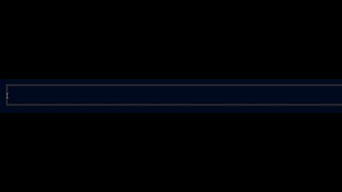

 

**Hola, soy Evan Bermúdez. Soy un desarrollador de software y analista de datos.**  
Me gusta aprender, investigar e implementar soluciones a problemas, mediante herramientas tecnológicas con el objetivo de facilitar la vida y labores de los demás.

 &nbsp;
 &nbsp;
 &nbsp; 
 &nbsp;
 &nbsp;
 &nbsp;
 &nbsp;
<!--
**3vanII/3vanII** is a ✨ _special_ ✨ repository because its `README.md` (this file) appears on your GitHub profile.

Here are some ideas to get you started:

- 🔭 I’m currently working on ...
- 🌱 I’m currently learning ...
- 👯 I’m looking to collaborate on ...
- 🤔 I’m looking for help with ...
- 💬 Ask me about ...
- 📫 How to reach me: ...
- 😄 Pronouns: ...
- ⚡ Fun fact: ...
-->
